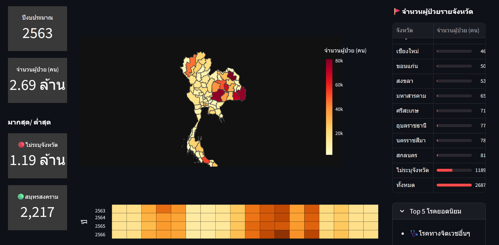

# 🍃 Mental Health Dashboard (Thailand)
🔗 [DEMO](https://thai-mental-health-dashboard.streamlit.app/) 📓[Notebook](https://github.com/Thutsaneeya/mental_health_dashboard/blob/main/notebook/mental_health.ipynb)

## Project Overview
- Provincial-level mental health data from Thailand
- Focus on year-over-year trends and regional disparities
- Visualizations include choropleth maps, heatmaps, KPI cards, and ranked disease lists

## Data Sources
- 🏛️ [Health Data Center (HDC), Department of Mental Health](https://dmh.go.th/report/datacenter/hdc/)
- 📍 [GeoJSON boundaries from OpenGISData-Thailand](https://github.com/chingchai/OpenGISData-Thailand/blob/main/provinces.geojson)

## Features
- 🗺️ Choropleth maps for patient distribution across provinces  
- 🔥 Heatmaps showing disease prevalence  
- 📊 KPI cards summarizing total cases and top/bottom provinces  
- 📋 Top 5 mental health conditions per year  
- 📆 Year-wise and province-level filtering

## Scope Limitations
- ✅ Focused on clean presentation and interactive storytelling

## Tools & Technologies
- `Python`, `Pandas`  
- `Plotly`, `Altair`, and `Streamlit`  
- `Jupyter Notebook` for basic data preparation
- 🗺️ `GeoJSON` for spatial mapping and choropleth visualizations
 
## How to Use
1. Clone the repository  
2. Run `streamlit run app.py`  
3. Select year and explore provincial insights

